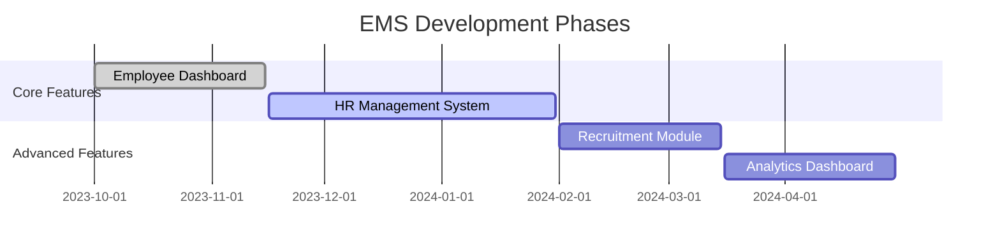

<div align="center">
  <h1>Modern Employee Management Solution</h1>
  <p>Streamlining HR operations with cutting-edge MERN stack technology</p>
  
  <p align="center">
    
    
    
  </p>
</div>

> [!IMPORTANT]
> **Note:** This project is currently under active development. Features and documentation are being regularly updated.

## 📸 Application Preview

<div align="center">
  <h3>✨ Key Screenshots</h3>
  
  <div style="display: grid; grid-template-columns: repeat(auto-fit, minmax(300px, 1fr)); gap: 20px; margin: 20px 0;">
    
    
    
  </div>
</div>

## 🌟 Core Features

| Category | Features |
|----------|----------|
| **🔐 Authentication** | JWT-based secure login, Role-based access control |
| **👥 Employee Portal** | Personal dashboard, Attendance tracking, Leave management |
| **📊 HR Management** | Employee records, Department management, Recruitment tracking |
| **💼 Operations** | Salary processing, Corporate calendar, Dynamic notifications |
| **✉️ Communication** | Email transactions, Real-time alerts, Notice distribution |

## 🛠 Technology Stack

**Frontend:**
- React.js with Vite
- Redux for state management
- Tailwind CSS + ShadCN UI components
- Chart.js for data visualization

**Backend:**
- Node.js with Express.js
- MongoDB with Mongoose ODM
- JWT for authentication
- Nodemailer for email services

## ⚙️ Installation Guide

```bash
# Clone the repository
git clone https://github.com/Darsh-Jogi/Employee-Management-System.git
cd Employee-Management-System

# Install backend dependencies
cd server && npm install

# Install frontend dependencies
cd ../client && npm install

# Configure environment variables
cp .env.example .env
```

### Environment Variables

**Server (.env)**
```ini
MONGODB_URI=your_mongodb_connection_string
JWT_SECRET=your_jwt_secret_key
MAILTRAP_TOKEN=your_mailtrap_token
PORT=5000
```

**Client (.env)**
```ini
VITE_EMPLOYEE_API=http://localhost:5000/api
```

## 🏃‍♂️ Running the Application

1. Start backend server:
```bash
cd server
npm run server
```

2. Start frontend development server:
```bash
cd ../client
npm run dev
```

## 🗺 Project Roadmap



## 🤝 Contributing

We welcome contributions! Please:
1. Fork the repository
2. Create your feature branch (`git checkout -b feature/AmazingFeature`)
3. Commit your changes (`git commit -m 'Add some AmazingFeature'`)
4. Push to the branch (`git push origin feature/AmazingFeature`)
5. Open a Pull Request


